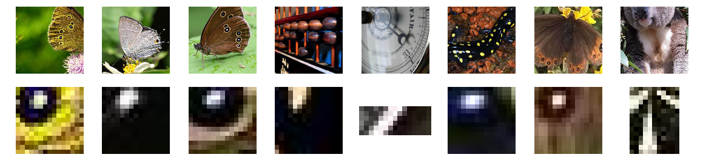

<p align="center">

</p>
<p align = "center">
   <a href="">
      
   </a>
   <a href="">
      
      </a>
   <a href="">
      
   </a>


   <a href="https://opensource.org/licenses/MIT">
      
   </a>
   <a href="htnses/MIT">
      
   </a>
</p>

<h2 align="center"> Introduction </h2>
CNNs do a great job at recognizing images (when appropriately trained).

Problems arrive when it comes to interpret the network: although one coded the network in question, and one knows all the tips and tricks necessary to train it efficiently, one might ignore **how** it generates the output from a given image.

Torchlurk aims at helping the user in that sense: it provides an interface to visualize a Pytorch network in an efficient yet simple manner, similarly to [Microscope](https://microscope.openai.com/models/alexnet/conv5_1_0).

All you need is the trained pytorch network and its training set. That's it.

<h2 align="center">  Installation &#9749 </h2>
Torchlurk is available on pip! Just run:

    pip install torchlurk

<h2 align="center"> Overview &#9757</h2>


<h2 align="center"> Documentation &#128218</h2>
Torchlurk has <a href="aadsfasf"> an online documentation </a> which gets regularly updated.

<h2 align="center"> Quick Start &#8987</h2>

### 1. Instanciation

```python 
import torchlurk
import torch

# load the trained model
your_model = ModelClass() 
your_model.load_state_dict(torch.load(PATH))

# the preprocess used for the training
preprocess = transforms.Compose(...)

# and instanciate a lurker
lurker = Lurk(your_model,
          preprocess,
          save_gen_imgs_dir='save/dir',
          save_json_path='save/dir',
          imgs_src_dir=".source/dir",
          side_size=224)
```

### 2. Layer Visualization

```python
# compute the layer visualisation for a given set of layers/filters
lurker.compute_layer_viz(layer_indx = 12,filter_indexes=[7])
# OR compute it for the whole network
lurker.compute_viz()
# plot the filters
lurker.plot_filter_viz(layer_indx=12,filt_indx=7)
```

<p align="center">
  
</p>

### 3. Max Activation

```python
#compute the top activation images
lurker.compute_top_imgs(compute_max=True,compute_avg=True)
# plot them
lurker.plot_top("avg",layer_indx=12,filt_indx=7)
```
<p align="center">
  
</p>

#### 3.1 Deconvolution
<p align="center">
  
</p>

```python
# plot the max activating images along with their cropped areas
lurker.plot_crop(layer_indx=2,filt_indx=15)
```
<p align="center">
  
</p>

### 4. Gradients

```python
#compute the gradients
lurker.compute_grads()
# plot them
lurker.plot_top("avg",layer_indx=12,filt_indx=7,plot_imgs=False,plot_grads=True)
```
<p align="center">
  
</p>

### 5. Histograms

```python
# display the 
lurker.plot_hist(layer_indx=12,filt_indx=7,hist_type="max",num_classes=12)
```

<p align="center">
  
</p>

### 6. Serving
Torchlurk is equiped with a live update tool which allows you to visualize your computed results while coding.

```python
#serve the application on port 5001
lurker.serve(port=5001)
```
<p align="center">
  
</p>
<p align="center">
  
</p>

```python
lurker.end_serve()
```


Happy Lurking! 

<h1> &#128373</h1>
